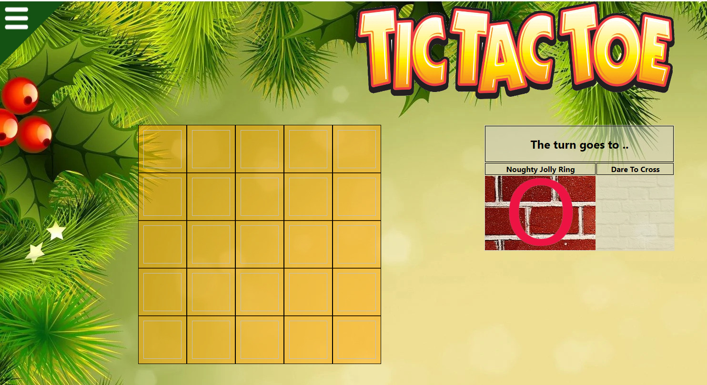
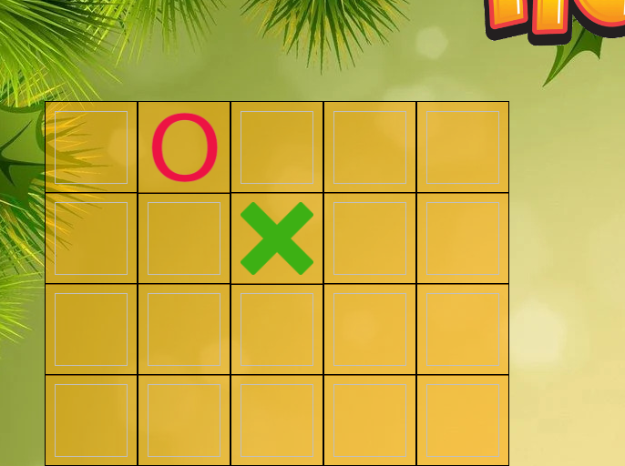
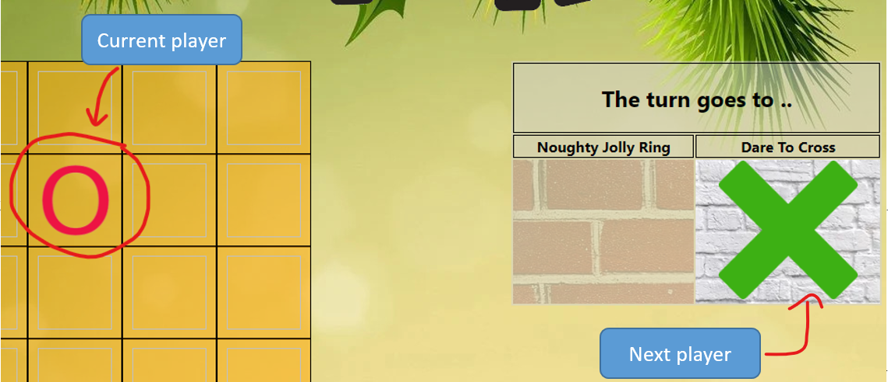
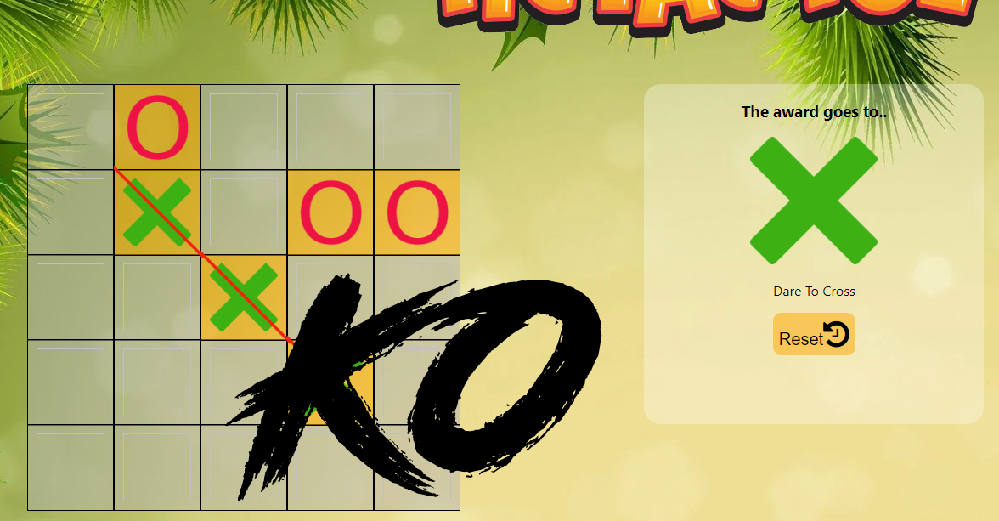
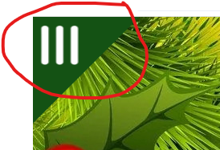
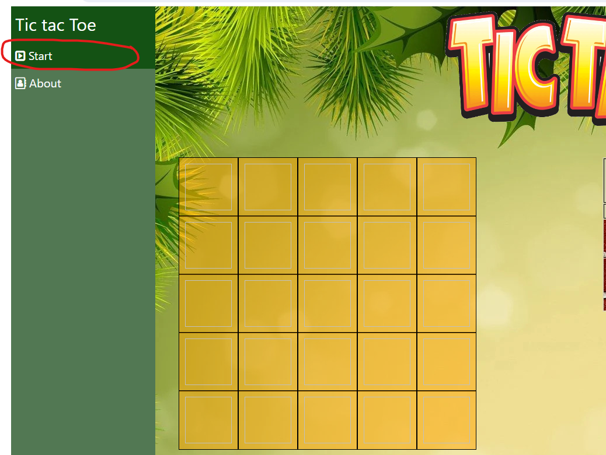
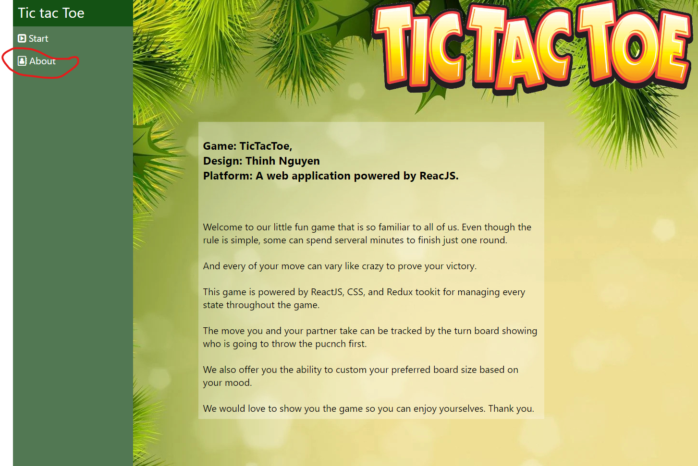

# Assumptions of the scope for the Classic Tic Tac Toe app assessment
### A.Gameplay:
      1. Board: The game is played on m x n grid where m is the number of rows and n is the number of columns.
      2. Turns: Players take turn placing their markers X and O on the empty squares.
      3. Winning condition: The first player to create horizontal or vertical or diagonal lined with their markers wins the game.
      4. Draw: If all the squares are filled and no winning condition met then the game is a draw.
      5. Replay: The game can be reset after finish.
### B.Test coverage:
      1. Component tests: Every component has their own test scenerio based on there functions and appearance.Usually they are tested on small and separate functions
      2. Page tests: The test will include the whole process of the game.
      3. Function tests: Some functions on checking game condition are tested.    

# Dependencies
The dependencies below were added out of the create-react-app scope\
    - @reduxjs/toolkit": "^2.0.1"\
    - @testing-library/jest-dom": "^5.17.0"\
    - @testing-library/react": "^13.4.0"\
    - @testing-library/user-event": "^13.5.0"\
    - classnames": "^2.5.1"\
    - react-redux": "^9.0.4"\
    - react-router-dom": "^6.21.1"\
    - redux": "^5.0.1"\
    - eslint": "^8.56.0"\
    - husky": "^8.0.0"\
    - prop-types": "^15.8.1"\
    - storybook": "^7.6.7"
      

# Getting Started with Create React App

This project was bootstrapped with [Create React App](https://github.com/facebook/create-react-app).

## Available Scripts

In the project directory, you can run:

Firstly, install all the dependencies for the project
### `npm install`

Lastly, start the project and Happy hacking
### `npm start`

Runs the app in the development mode.\
Open [http://localhost:3000](http://localhost:3000) to view it in your browser.

- Initial screen.\

- Click on the square to start the game\

- The next turn of which player shown on the Turn Tbale on the right.\

- Vertical or horizontal or diagonal with 3 marks and you win.\

- On the top left corner hold the burger menu which is hiding the sidebar of routes.\

- Click on the item on sidebar to navigate to other page, you are in Start which is the default route.\

- Now you are in About page.\

The page will reload when you make changes.\
You may also see any lint errors in the console.

## For more information about the project structure.Please hit the link below:
[PROJECT.md](/PROJECT.md)

